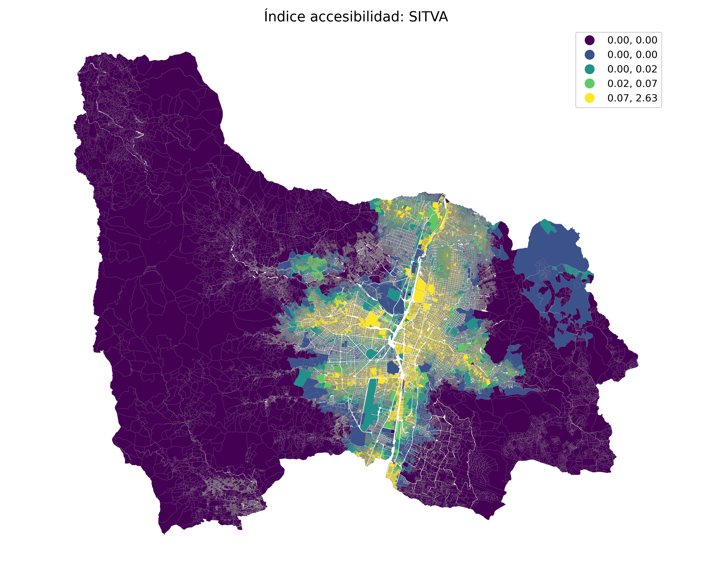

#python #networkx #geopandas #urbanmobility #accessibility #transportmodeling

# 🗺️ Cálculo de Tiempos por Lote usando NetworkX – Proyecto SITVA

Este proyecto implementa una metodología de cálculo de tiempos de desplazamiento desde cada lote del Valle de Aburrá hacia el sistema de transporte público (SITVA), mediante redes viales modeladas como grafos dirigidos en Python.

## 📌 Objetivos

- Representar la red vial como un grafo con pesos por tiempo de recorrido.
- Conectar lotes urbanos a la red vial.
- Calcular tiempos mínimos de viaje desde cada lote hasta puntos de acceso al sistema SITVA.
- Exportar resultados en formatos espaciales y tabulares para análisis posterior.

## 🛠️ Tecnologías

- Python
- Pandas
- GeoPandas
- NetworkX
- Shapely
- Matplotlib

## 📁 Estructura

- `notebooks/`: Contiene el desarrollo principal (`01_SITVA.ipynb`).
- `data/`: Espacio reservado para insumos como shapefiles de nodos, edges y lotes.
- `output/`: Resultados en formatos CSV o GeoJSON.
- `requirements.txt`: Lista de dependencias necesarias para correr el proyecto.

## ⚙️ Cómo ejecutar

```bash
git clone https://github.com/stevenesghost/Accesibilidad_SITVA.git
cd calculo_tiempos_sitva
pip install -r requirements.txt
jupyter notebook notebooks/01_SITVA.ipynb
```
### 🖼️ Ejemplo de resultado


📄 Licencia y Reconocimientos
Este proyecto fue desarrollado en el marco de una consultoría técnica para el Observatorio DensURBAM — Línea de Naturaleza y Ciudad.
Parte de la lógica y los datos empleados están sujetos a acuerdos de confidencialidad, por lo cual este repositorio incluye únicamente una versión adaptada para fines demostrativos y educativos.
